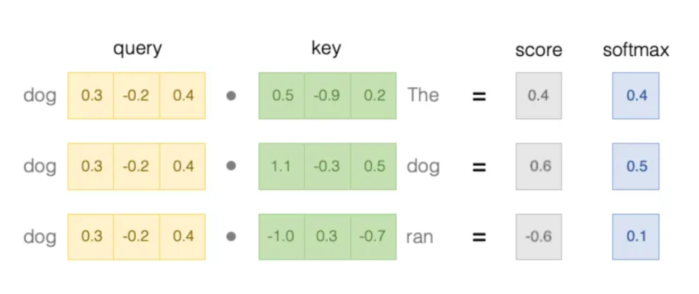
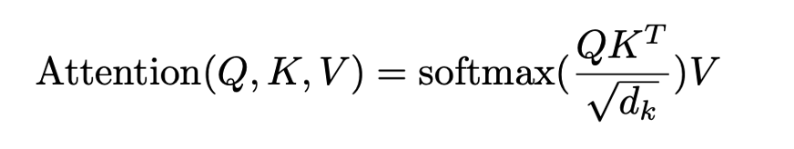
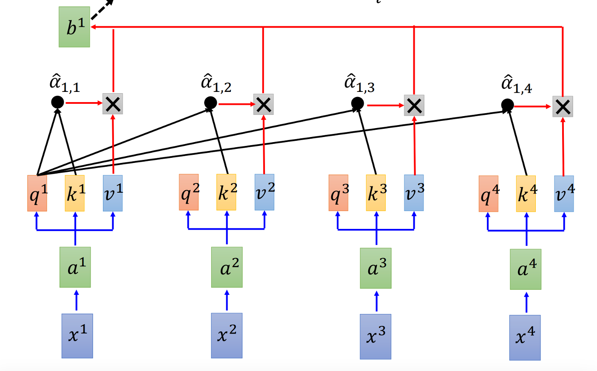
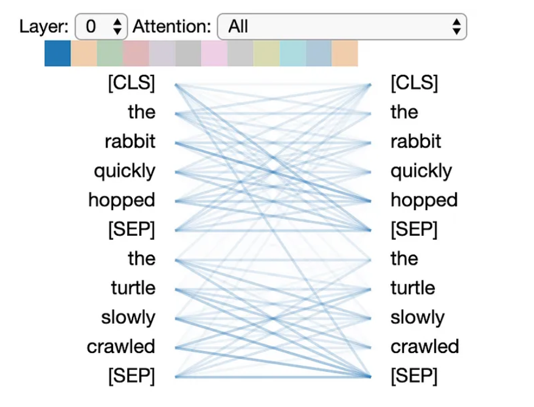
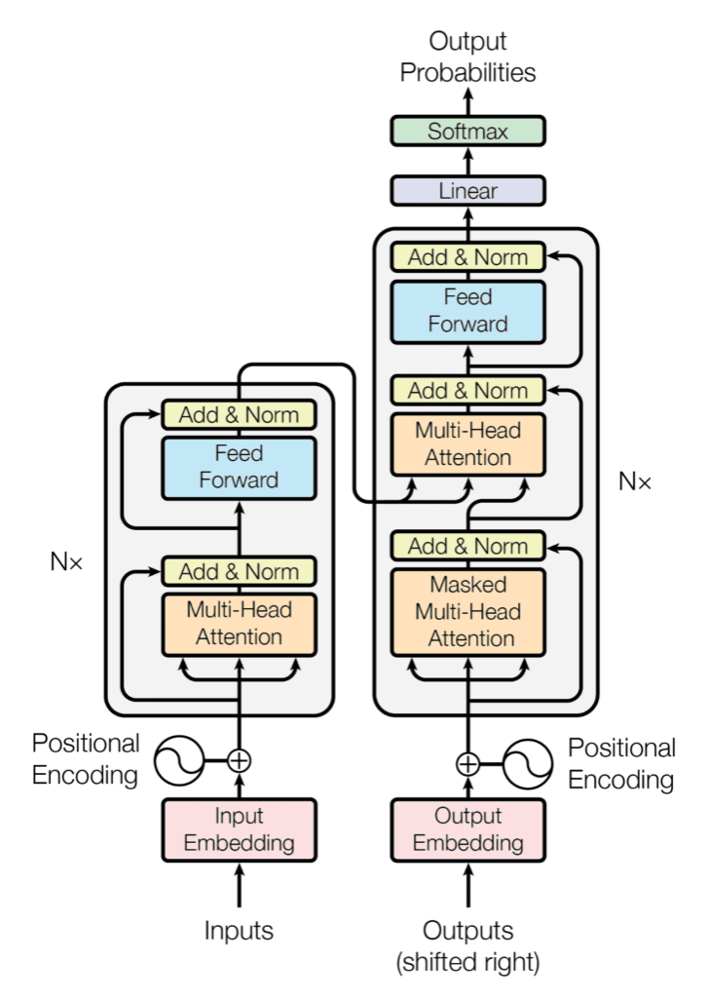
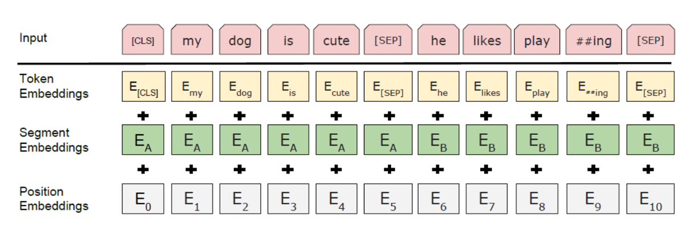
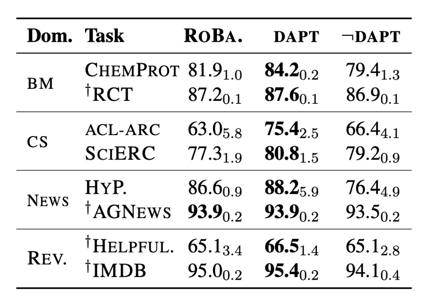
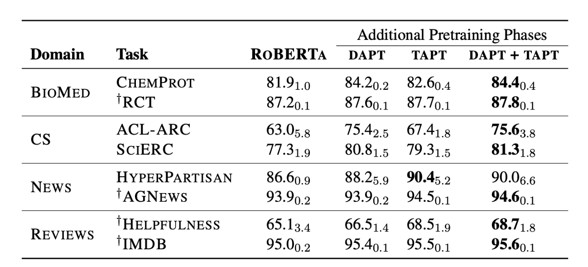
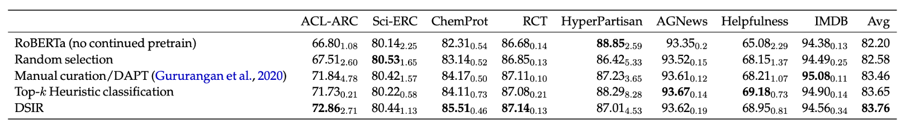

# CS7140-project
# Pretraining Data selection via Importance Resampling
## Introduction
  There are many language models nowadays, they may use different structures, but their goals are generally the same: either predicting words in a sentence or generating answers to a question, etc. To do this, the models are usually pretrained with some huge existing language data sets (first) such as Wikipedia. Then it is trained on some specific data sets (second) depending on one's task. There are little arguments regarding choice for the first pretraining data set. However, how to choose the continued pretraining data set is one of the area for researches. There are generally two approaches: domain general pretraining and domain specific pretraining. This repository discusses these data selection methods and how they affect the performance.
### Domain general pretraining
  Domain general pretraining refers to choosing the second training data set with similar distributions to the first pretraining data set (Wikipedia). It disregard the task one is trying to accomplish and the domain the task is in. For example, it could simply draw more data from Wikipedia or some other formal text data sets such as BookCorpus.
### Domain specific pretraining
  Domain specific pretraining refers to choosing the second training data set in the same domain as your task. For instance, if the task is predicting words or extracting relationship in a sentence from medical papers, then your second pretraining data set would be chosen from medical data texts.

  Knowing the two data selection methods, let's first take a look at one famous lanague model and build on this model to get a better sense as to how data selection affects the performance of language models.

## BERT
  One famous language model is BERT. It is pretrained on 16 GB of data including English Wikipedia and BookCorpus. It employs sevaral mechanism such as self-attention and transformer architecture to make it different from conventional lanauage models such as RNNs. The transformer architecture prevents the vanishing/exploding gradient problem and enables parallel computing, which makes BERT faster and more accurate.

### self-attention
  Self attention is essentially a weighted sum of input vectors. For each word, three vectors are generated: query, key and value. Query and key are learned through training data and value is a vector generated through several embedding methods. Intuitively, when we are trying to build a language model, we need to learn how each words in a sentence is connected and we wish to focus on specific words that are important to our task. For example, if we are predicting a missing word in "John is ___ in a restaurant near school." If we focus on the word "restaurant" instead of "John" and "school", then a likely prediction is "eating", however, if we focus on "school", then the likely prediction is "studying". But of course, we want the previous answer. So this sentence should put more weights on "restaurant" instead of "school". 
In self-attention mechanism, weights between one word and the others are learn through the dot product between the query vector of that one word and the key vector of all the other words. The separation of query and key vectors allows an asymetric weight connection between words, which means that weights between the same two words can be different depending on the direction we are looking at.

The above image shows one example of attention mechanism where the original sentence is "The dog ran". Here, the relationship between the word "dog" and the other words are shown by "score", which is then passed through a softmax layer to display the final weights. The image shows that the word "dog" is most related to itself, then to the word "The" and very little connection with the word "ran". Of course, this only illustrates how self-attention works and its weights should not be considered as reality.
The actual attention equation is a little different shown in the equation below.

The dk is the length of the sentence. For our previous exmaple "The dog ran", dk would be 3. It is here because longer sentence tends to have larger score values computed, thus dividing it by the length mitigate the effects from having a long sentence.
After the weights are computed, they are then multiplied with the value vector to compute the output.

The alpha hats are normalized weight vectors, their products with value vectors are then summed together to form the first output b.

### Transformer architecture
Between the input and output of BERT is the transformer architecture, it utilizes the self-attention mechanism. As we mentioned above, for an input sentence, BERT learns a weight association between each words. Such an association is called a "head".

This image above is one head. The transformed architecture consists of 6 layers of encoder and 6 layers of decoder.

For each encoder layer, there are two sublayers: the first consists of 12 heads. Each head receives a different projection of query, key and value vectors. And the second layer is a fully connected feed forward layer with ReLU activation.
The decoder works in a similar way, there are three sublayers, the latter two are similar to that of encoder layer. The first sublayer is a masked multi-head attention layer, which means that instead of knowing all the weight connections, it receives only the bottom half of the weight matrix. So the decoder first sublayer knows only weights between each word and its preceding words.

### Embedding
Now let's look at how BERT embeds words into vectors. For every input, BERT first use the WordPiece Tokenizer to get a token embedding of the input. Then BERT adds that with segment embedding and positional embedding to form the final embedding of the words. Segment embedding refers to the sentence each word is in. Because BERT allows up to 2 different sentence in one input (usually in the form of question and answer), each word can belongs to sentence A or B. Positional embedding refers to the position each word is in. WordPiece Tokenizer returns the same embedding for the same word, so positional embedding allows same words at different places to have different embeddings.

The <SEP> token is used to separate the two sentences in the input and <CLS> token is placed before every input, it stores the information related to a task called Next Sentence Prediction.
  
So now we know how BERT works, it first embeds input sentence into value vectors through token embedding, segment embedding and positional embedding. Then the query and key vectors are trained under transformer architecture with self-attention mechanism. After training, we have a well-trained query and key vector for each word embedding. For BERT, there are two training tasks: Masked Language Model (MLM) and Next Sentence Prediction (NSP).
  
### MLM and NSP
MLM masks random words in the original text. Some of which is masked with <MASKED> token, some replaced by other random words and some are kept unchanged. BERT receives the positions of these masked words and is trained to recover the original words.

  NSP draws two sentences, sometimes they are adjacent in the original text, while sometimes they are from random places. BERT is then trained to predict whether they are adjacent originally or not. As we mentioned above, this information is stored in the <CLS> token before every input.
  
### RoBERTa
  RoBERTa is another famous language model based on BERT, there are some minor differences. The pretraining data set for RoBERTa is 10 times bigger and instead of having MLM and NSP as tasks, RoBERTa abandons NSP and adopts a dynamic MLM as its only task. Dynamic MLM is simply MLM, but the masked words changes each time.

### Concerns
  While BERT works better than RNNs, it has its concerns. Researches realized that there are some specific domains where BERT doesn't work well on, such as on medical and CS texts. So domain adaptive pretraining is proposed. It basically is that after pretraining RoBERTa on the original 160 GB of data, we train the model on data that is under the same domain as our task.
 
  ## Don't Stop Pretraining
  The paper *Don't Stop Pretraining* by Gururangan explores the effects of continued pretraining on domain adaptive data. Four common domains are chosen: BioMed, CS, News and Reviews. For each domain, the author chose two tasks. Tasks like "ChemProt" from BioMed is a relationship extraction task. The model is trained to match the input with one relationship from a list of relationships. "ChemProt" includes a list of chemical-protein interactions and a collection of abstracts of medical papers and asks the model to correctly match each abstract with the interaction it's talking about.
  Below shows the result.
  
  
  
  The values are F1 scores, DAPT refers to pretraining again on domain adaptive data sets selected by the author. And "-DAPT" refers to cross-domain pretraining, so instead of pretrain RoBERTa on BioMed data for BioMed task, it trains the model on data from other domains for BioMed task. As we can see, DAPT improves the performance and cross DAPT degrades the performance.
  
  ### TAPT
  Other than domain adaptive pretraining, this paper explores another pretraining method called task adaptive pretraining, instead of pretraining on domain adaptive data set, TAPT uses directly the task data (but without labels) to train the model. The result is shown below.
  
  
  
  As the data shows, TAPT sometimes perform better than DAPT, but both methods outperforms the domain general pretraining. And we don't do TAPT+DAPT because it would result in the forget of TAPT data.
  
  ## Data selection
  An important takeaway is that instead of pretrain the model on domain general data, training it on specific data set can result in better performance. However, manual curation is sometimes expensive, so how to select domain-adaptive or even task-adaptive training data set can be a problem.
  The paper *Data Selection for Language Models via Importance Resampling* aims to tackle this problem by using importance resampling to select pretraining data automatically.
  ### Importance Resampling
  Importance resampling is essentially a monte carlo sampling method. Assuming target data distribution is p(X), then we can first generate our own distribution q(X) and sample N data points according to q(X). Then compute $w(X) = \frac{p(X)}{q(X)}$. Then we can use Gumble's top K trick to sample K data points from the previously sampled N data points with probability w(X). As N and K grows larger, our K data points will follow distribution p(X).
  ### Data Sampling Importance Resampling (DSIR)
  DSIR's goal is to choose our pretraining data set from a big pile of raw data so that our selected data follows a similar distribution to the target data (task data).
  In this paper, the distribution for target data is defined as follows:
  1. Split data into unigrams and bigrams: "Alice is eating" will be splitted into ["Alice", "is", "eating", "Alice is", "is eating"].
  2. Then each "word" (unigrams and bigrams) will be hashed into an index between 0 and 9999.
  3. Use bag of word model: return the count of occurrences of each index $z \in R^{10000}$
  4. Then p is defined with parameter $\gamma \in R^{10000}$: $p(Z) = \prod_i \gamma_i^{z_i}$
  Raw data distribution q(X) is defined in the same way.
  
  After defining the probability distribution, we draw N data from raw data with probability q(X). Then find $w(X) = \frac{p(X)}{q(X)}$ for each selected data and finally use Gumbel top-K trick to select K data with probability w(X) from the N data. (Notice each data is a pair of sentence)
  In this way, with increaing N and K, the selected data will have a more and more similar distribution to the target data.
  The result is shown below.
  
  
  There are two main takeaways from this:
  1. Random selection outperforms the base model, indicating that more training data is benefitcial to language models.
  2. DSIR results in better accuracy than DAPT in most tasks and is on par with DAPT on the rest, indicating the possbility for the automatic alternative to replace manual curation.
  
  ## Conclusion
  So this paper based itself on domain adaptive pretraining and explored how selecting data via importance resampling can help improve the performance of RoBERTa. It displays the possibility of DSIR to replace manual curation in selecting pretraining data sets. In conclusion, although there are a few areas that could use improvements (discussed in next section), DSIR showed some minor improvements and can be helpful.
  
  ## Further discussion
  This paper defines distribution of data using the bag of words model. This is a simply and direct model and it works on giant data sets such as the internet text data. However, this might not be the best model due to its lack of considerations of other features such as ordering and meaning of each words. Whether there are other models that works better (and as fast) as a distribution on our data set remains an open question.
  
  The other area that needs exploration follows naturally: is N-gram a good feature space? And is hashing them into an index between 0 and 9999 a good choice? Since collision is inevitable, whether this would result in completely different texts having very similar distribution and thus degrade the perform is unknown.
  
  Both needs more researches.
  
  ## Sources
  1. Devlin, J. BERT: Pre-training of Deep Bidirectional Transformers for Language Understanding https://arxiv.org/pdf/1810.04805.pdf
  2. Gururangan, S. Don’t Stop Pretraining: Adapt Language Models to Domains and Tasks https://arxiv.org/pdf/2004.10964.pdf
  3. Vaswani, A. Attention is All You Need https://arxiv.org/pdf/1706.03762.pdf
  4. Xie, S. Data Selection for Language Models via Importance Resampling https://arxiv.org/pdf/2302.03169.pdf
